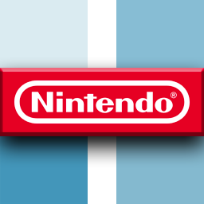
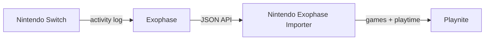

<div align="center">

# Nintendo Exophase Importer — Playnite extension


  
  
</div>
</br>

Pulls the playtime of your **Nintendo Switch** and **Switch 2** games from your
[Exophase](https://www.exophase.com/) profile and writes it into Playnite:

- **imports** missing Switch games as new entries (platform *Nintendo Switch* / *Nintendo Switch 2*,
  source *Nintendo*), with playtime, last‑played date and a link to Exophase;
- **updates** the playtime and last‑played date of Switch games already in your library.

Syncing is **idempotent**: imported games are tagged with a stable `GameId`
(`exophase:<id>`), so running it again updates instead of duplicating.

Metadata (cover, description, genres, release date, …) is downloaded automatically by Playnite for newly imported games using your configured metadata provider (IGDB by default).



## Requirements

> **Your profiles must be public:**
> - **Exophase profile** — must be set to public in your Exophase account settings.
> - **Nintendo Switch activity log** — must be set to public in your Nintendo Switch console
>   settings (User Settings → History games settings → Show game history to everyone ).

## How it works

Exophase has no documented public API, but the site exposes an internal JSON API on a
separate subdomain (which is why it does not show up in the Network tab of the profile page):

1. The page `https://www.exophase.com/user/<username>/` embeds the player id in its HTML
   (`window.playerProfileId = ...`). The extension loads it through Playnite's embedded
   browser (CefSharp) to get past Cloudflare, and extracts the id.
2. Games are then read, page by page, from
   `https://api.exophase.com/public/player/<id>/games?page=N` (JSON, no authentication).
3. Entries whose platform is *Switch* / *Switch 2* are kept, and `playtimeUnits.hours/minutes`
   gives the playtime.

## Settings

Playnite Menu → Add-ons → Extensions settings → Librairies → **Nintendo Exophase Importer**:

**Exophase account**
- **Exophase username** — your global Exophase account username (this is **not** your
  Nintendo account name). A profile URL also works.

> **Keep your Exophase data fresh first.** Exophase does not refresh on its own:
> open your Exophase user page → **Nintendo** tab → **Options** → **Run profile sync**,
> wait a moment, then run the library update from Playnite.

**Platforms**
- **Import Switch games** / **Import Switch 2 games** — which platforms to include.

**Playtime**
- **Import playtime** — write the Exophase playtime into Playnite.

**Other data**
- **Import last played date**.

**Filters**
- **Skip demos** — ignore titles that look like demos.
- **Ignore games played less than N minutes** — `0` imports everything.

## Usage

Main menu → **Update game library** → **Nintendo Exophase Importer**  
*(or "Update all" to refresh all libraries at once)*

Playnite will automatically prompt to download metadata (IGDB) for any newly imported games.

## Build (development)

Requirements: a .NET SDK (≥ 5) with `dotnet`, Playnite installed (it provides
`Playnite.SDK.dll` at runtime), and the `nuget.org` package source configured.

```powershell
dotnet build .\NintendoExophaseImporter.csproj -c Release
```

Output lands in `bin\Release\` (DLL + `extension.yaml` + `icon.png`). The Playnite SDK is
deliberately **not** copied to the output (Playnite ships its own copy).

Helper script:

```powershell
.\build.ps1            # build only
.\build.ps1 -Install   # build + copy into %AppData%\Playnite\Extensions (restart Playnite)
.\build.ps1 -Pack      # build + produce dist\*.pext via Toolbox
```

## Package (.pext)

```powershell
& "$env:LOCALAPPDATA\Playnite\Toolbox.exe" pack ".\bin\Release" ".\dist"
```

Double‑click the resulting `dist\NintendoExophaseImporter_<version>.pext` to install.

## Notes & limitations

- **Both profiles must be public** — your Exophase profile and your Nintendo Switch activity
  log (console settings) must be set to public, otherwise the sync cannot retrieve your data.
- **Exophase only tracks the last ~20 games** the Switch shows in its activity log
  (a Nintendo limit). Once a game has been seen, Exophase keeps it, but the initial history
  may be incomplete.
- Imported games are catalog entries (not launchable) — you can't launch a Switch game from PC :p.
